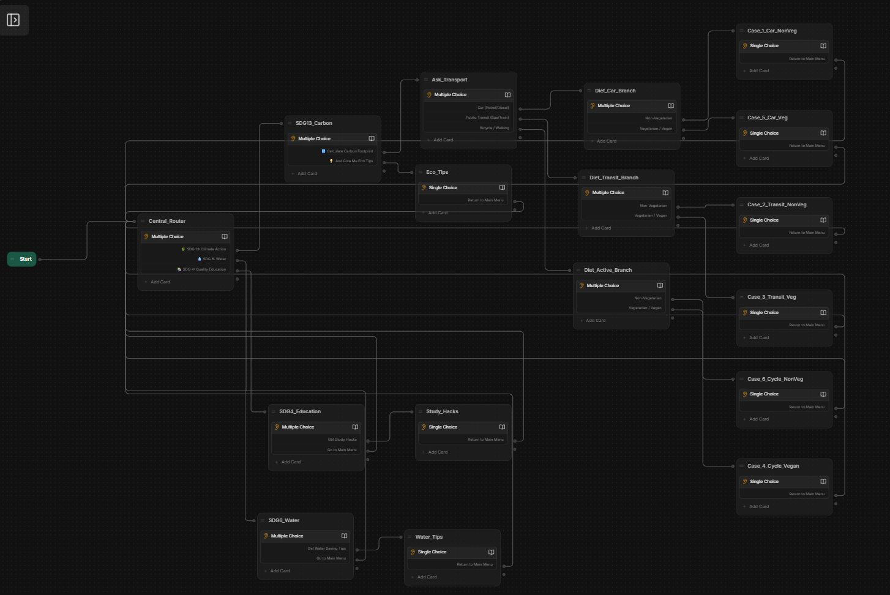

# EduEco AI - Multi-SDG Conversational Agent

## 📌 Project Overview
This repository contains the full operational deployment files for my **AI Capstone Project**, completed as the primary milestone of my virtual internship in **Generative AI & Agentic Systems Engineering**. This program is hosted under the **Lenovo LEAP NextGen Scholar Program** (an initiative of Lenovo, implemented by BharatCares, in association with AICTE).

This multi-tenant conversational prototype serves as the core implementation phase of the internship, demonstrating practical technical expertise in conversational state management, node routing architectures, and prompt boundary conditions before proceeding to the final Skill India certification assessment.

---

## 📊 Project Presentation & Workflow Blueprint

 

---

## Core Pillars
* 🌿 **SDG 13 (Climate Action):** Formulates 6 customized carbon footprint scores based on user inputs.
* 📚 **SDG 4 (Quality Education):** Provides immediate access to learning strategies like Pomodoro and Active Recall.
* 💧 **SDG 6 (Clean Water):** Delivers domestic resource conservation benchmarks and daily efficiency protocols.

---

## 🛠️ System Architecture
1. **Central Router:** A landing menu segments user intentions using a clean button selection array.
2. **Context-Aware Branches:** Guides users safely through individual SDG question nodes to display structured response strings.
3. **Unified Looping:** Loops all terminal results back to the master router node to eliminate conversation dead ends.

---

## 📥 Step-by-Step Guide: How to Import & View the Workflow

Because this project is built entirely on Botpress, the architecture is contained within the compressed binary file `EduEco AI.bpz`. Follow these quick steps to open and explore the workflow blueprint visually:

1. **Download the File:** Click on the `EduEco AI.bpz` file in this repository and select **Download** (or click **View raw**).
2. **Open Botpress Cloud:** Log into your [Botpress Cloud Dashboard](https://app.botpress.cloud/).
3. **Create a New Bot:** Click on **Create Bot** to start a fresh workspace.
4. **Import the Project:** 
   * Open the new bot's studio editor.
   * Click the menu icon (top-left corner).
   * Select **Import / Export**.
   * Choose **Import** and select the downloaded `EduEco AI.bpz` file.
5. **Explore:** The complete workflow layout, routing logic, and nodes will instantly render on your screen.

